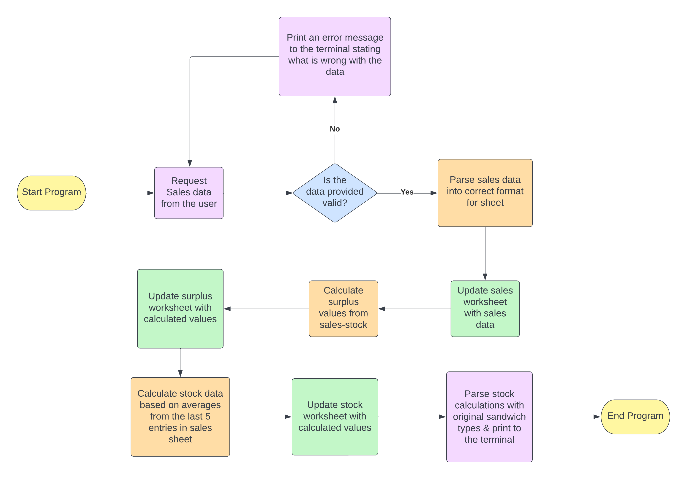
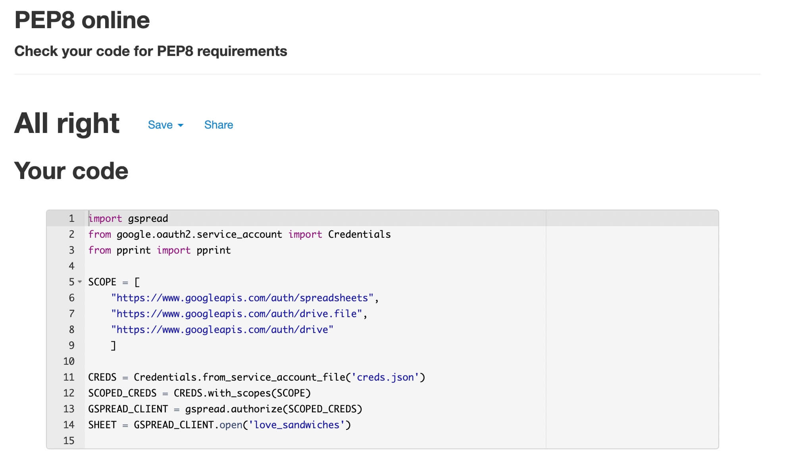

# Love Sandwiches

Love Sandwiches was created as part of a walkthough project on the Code Institutes Level 5 Diploma in Web Application Development.

## CONTENTS

* [User Stories](#user-stories)
* [Logic Flow Chart](#logic-flow-chart)
* [Technologies Used](#technologies-used)
  * [Languages Used](#languages-used)
  * [Frameworks, Libraries & Programs Used](#frameworks-libraries--programs-used)
* [Local Development](#local-development)
    * [How to Fork](#how-to-fork)
    * [How to Clone](#how-to-clone)
* [Testing](#testing)
* [Credits](#credits)

- - -

## User Stories

This project was created for a sandwich shop to be able to work out how many sandwiches to create for their next market based on their sales and surplus data from their previous markets.

- - -

## Logic Flow Chart

- - -

## Technologies Used

### Languages Used

* Python3

### Frameworks, Libraries & Programs Used

* [Git](https://git-scm.com/) - For version control.

* [Github](https://github.com/) - To save and store the files for the website.

* [Shields.io](https://shields.io/) To add badges to the README.

* [Lucid.app](https://lucid.app/) To create the logic flow diagram.

* [Tiny PNG](https://tinypng.com/) To compress images used in the readme.

* [Google API's](https://developers.google.com/sheets/api) were used to enable me to access and update the Google Sheets.

- - -

## Local Development

#### How to Fork

To fork the repository:

1. Log in (or sign up) to Github.
2. Go to the repository for this project, [Love Sandwiches Repo](https://github.com/kera-cudmore/love-sandwiches).
3. Click the Fork button in the top right corner.

#### How to Clone

To clone the repository:

1. Log in (or sign up) to GitHub.
2. Go to the repository for this project, [Love Sandwiches Repo](https://github.com/kera-cudmore/love-sandwiches).
3. Click on the code button, select whether you would like to clone with HTTPS, SSH or GitHub CLI and copy the link shown.
4. Open the terminal in your code editor and change the current working directory to the location you want to use for the cloned directory.
5. Type 'git clone' into the terminal and then paste the link you copied in step 3. Press enter.

- - -

## Testing

Testing was carried out throughout the build of the project by utilising print statements to ensure the project was running as envisioned.

The code was also run through [PEP8](www.pep8online.com) a python code validator.

- - -

## Credits

* The Love Sandwiches Google Sheet was provided by the Code Institute.
